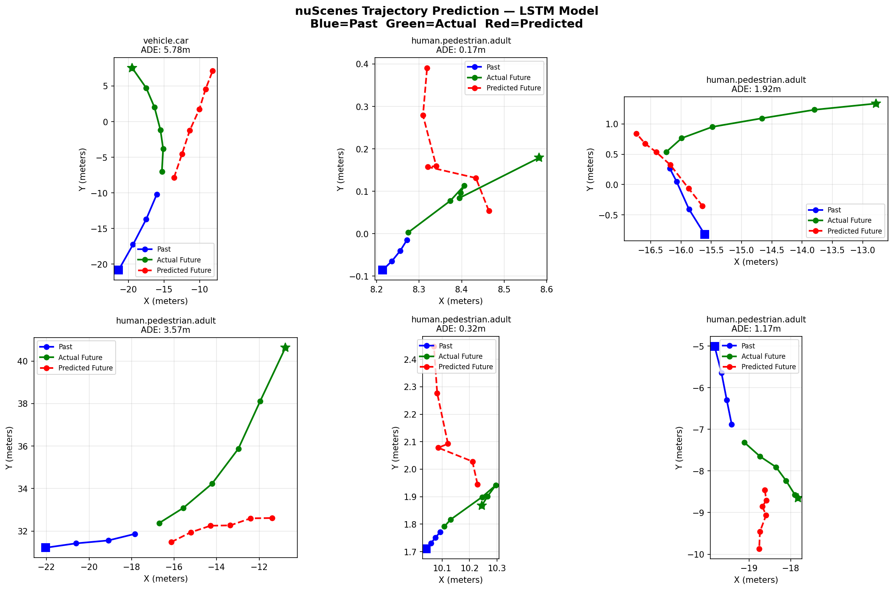

# nuScenes Trajectory Prediction

LSTM-based trajectory prediction model trained on the nuScenes autonomous driving dataset.

## Results

| Metric | Score |
|--------|-------|
| minADE | 2.26 meters |
| Dataset | nuScenes mini (10 scenes) |
| Architecture | LSTM Encoder-Decoder |



## Architecture

- Encoder: 2-layer LSTM (hidden size 64) reads 4 past frames
- Decoder: Linear layer predicts 6 future frames
- Input: Ego-relative (x, y) coordinates, normalized
- Output: 6 future positions per agent

## Dataset

- 10 driving scenes, Boston and Singapore
- 562 filtered trajectories (vehicles + pedestrians)
- 7118 training samples, 1767 validation samples

## Run

```bash
python3 prepare_data.py
python3 build_samples.py
python3 train.py
python3 evaluate.py
python3 visualize.py
```

## Next Steps

- Full nuScenes dataset (700 scenes)
- Transformer encoder with attention
- HD map integration
- Multiple predictions (K=5)
- Leaderboard submission
